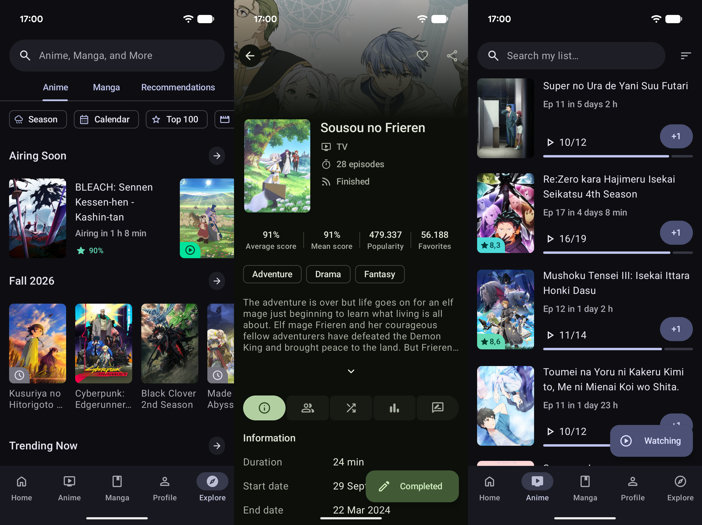

# AniHyou

[](https://github.com/axiel7/MoeList/releases/latest)
[](https://crowdin.com/project/anihyou)
[](https://ko-fi.com/axiel7)

Another unofficial Android AniList client

[](https://play.google.com/store/apps/details?id=com.axiel7.anihyou)
[](https://f-droid.org/packages/com.axiel7.anihyou)

iOS version [here](https://github.com/axiel7/AniHyou-iOS)

Get latest beta version from [nightly.link](https://nightly.link/axiel7/AniHyou-android/workflows/build-upload-android/develop)

Follow the development on the official Discord server:

[](https://discord.gg/CTv3WdfxHh)

# Screenshots


## Coming features
- [See project](https://github.com/users/axiel7/projects/2/views/1)

# Donate 💸
Support the development of AniHyou by making a donation via:

[Ko-Fi](https://ko-fi.com/axiel7)

BTC
```
3KKjJuorh9se2jUo1Hr6MFgXhnBWbj5fTP
```

ETH
```
0xBd20dD0e036B246F879EeFde52601f0fBbeC69c0
```

LTC
```
MRw5XPLsM9SVf48tv4nwQoY12nMXaiVzmD
```
